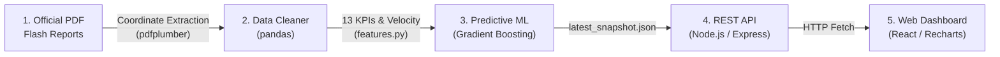

> **Transforming India's central infrastructure monitoring from retrospective reporting into an AI-powered predictive early warning system.**

---

## 🚀 Quick Start (Copy & Paste to Run Everything)

Run this single block in your terminal from the project root folder. It sets up the Python environment, generates the ML data, installs unified Next.js dependencies, and **starts the full-stack system**:

```bash
python3 -m venv venv
source venv/bin/activate
pip install -r requirements.txt
python src/run_all.py

npm install
npm run dev
```

Once running, open your web browser:
- 🌐 **Interactive Dashboard**: [http://localhost:3000](http://localhost:3000)
- ⚙️ **Unified REST API**: [http://localhost:3000/api/kpis](http://localhost:3000/api/kpis)
- 🩺 **System Health**: [http://localhost:3000/api/health](http://localhost:3000/api/health)

*(To stop the server anytime, press `Ctrl + C`.)*

---

### Step-by-Step Breakdown

<details>
<summary>👉 Click here to view step-by-step instructions</summary>

#### Step 1 — Python ML Pipeline & Data Extraction
```bash
python3 -m venv venv
source venv/bin/activate
pip install -r requirements.txt
python src/run_all.py
```

#### Step 2 — Unified Full-Stack Web Application (Next.js 15)
```bash
# from root directory of the project
npm install
npm run dev
# Running on http://localhost:3000
```
Both the Next.js frontend pages and the serverless REST API route handlers (`/api/...`) run on a single unified port (3000) with zero CORS configuration required.
</details>

---

## 📖 What This Project Does (In Simple Words)

The Ministry of Statistics and Programme Implementation (MoSPI) tracks **2,059+ major central infrastructure projects** (like highways, railway tracks, oil refineries, and power grids) worth over **₹42.78 Lakh Crore**.

### The Problem:
Historically, monitoring has been **retrospective** (looking backward). Government officials only find out that a project has failed **after** the deadline has already passed or after budget money has run out.

### The PAIMANA AI Solution:
This project acts as an **Early Warning Radar**. It ingests official monthly Flash Reports and uses Machine Learning to:
1. **Predict Cost Escalation**: Forecasts which projects are likely to ask for more budget in the next 30 days.
2. **Predict Schedule Slippage**: Forecasts which projects are about to delay their completion deadline.
3. **Score Project Health (0–100)**: Gives every project an easy-to-understand health score categorized into 4 action bands (**Low**, **Medium**, **High**, **Critical**).
4. **Identify the Root Cause**: Tells ministers *why* a project is in trouble (e.g. *Slow Construction Work*, *Excessive Spending*, *Repeated Timeline Revisions*).
5. **Peer Cohort Benchmarking**: Automatically compares a project to similar projects in the same state and ministry to detect anomalies.

---

## 🧠 The "Dual-Engine" Approach (Why It's Smart)

Government auditors and ministers cannot legally take action on an unexplained "black box" prediction. That is why our system has **two independent engines**:

1. **Engine 1 — Current State (Pure Mathematics & Rules)**:
   - Computes where the project stands today.
   - Completely transparent, verifiable, and auditable by government officials.
   - Calculates delay months, overrun percentage, and the 0–100 composite risk score.
2. **Engine 2 — Early Warning (Machine Learning Ensemble)**:
   - Powered by `GradientBoostingClassifier` trained on 7,497 historical project snapshots.
   - Discovers subtle warning signals (e.g. *work has stopped for 2 straight months while budget is 80% spent*).
   - Outputs a forward-looking risk probability for the next 30 days.

---

## 🔄 Project Flow in Brief



1. **Extraction**: `src/pdf_extracter.py` reads multi-page table layouts from official government PDFs using coordinate clustering.
2. **Cleaning & Panel**: `src/data_loader.py` parses dates, cleans numbers, and builds a 4-month longitudinal panel of 7,497 records.
3. **Feature Engineering**: `src/features.py` calculates 13 metrics (progress gaps, spend divergence, rolling velocity).
4. **ML Training & Scoring**: `src/model_train.py` trains Gradient Boosting models (ROC-AUC ~0.88), and `src/export_for_backend.py` predicts next month's risk.
5. **Serving & Dashboard**: `backend/server.js` serves 8 REST endpoints to an interactive, responsive `React 18` dashboard.

---

## 📁 Repository Structure

```
Paimana-analysis/
├── data/
│   ├── pdfs/               ← Raw MoSPI Flash Report PDFs
│   ├── raw/                ← Extracted monthly CSV files
│   └── processed/          ← 4-month panel, ML models (.joblib), JSON exports
├── src/
│   ├── pdf_extracter.py    ← PDF → CSV coordinate extractor
│   ├── data_loader.py      ← Data cleaning, date parsing, panel builder
│   ├── features.py         ← Feature engineering & 0-100 risk score formula
│   ├── labels.py           ← Future look-ahead target labels (T+1)
│   ├── pipeline.py         ← Multi-month panel orchestrator
│   ├── model_train.py      ← Model training (Gradient Boosting & Logistic Regression)
│   ├── export_for_backend.py ← Generates latest_snapshot.json for backend
│   └── run_all.py          ← One master command to run the whole pipeline
├── backend/
│   ├── server.js           ← Node.js Express REST API (8 endpoints)
│   └── package.json
├── frontend/
│   ├── src/                ← React 18 + Vite + Recharts UI source code
│   └── package.json
└── docs/                   ← Comprehensive Documentation Suite
    ├── README.md                          ← Documentation hub & reading guide
    ├── 01_ARCHITECTURE_AND_FLOW.md        ← Detailed pipeline, diagrams & tech scaling
    ├── 02_MODEL_AND_METHODOLOGY.md        ← Target variables, 13 features & evaluation
    ├── 03_DASHBOARD_AND_METRICS_GUIDE.md  ← Screen-by-screen UI guide & data dictionary
    ├── 04_PROJECT_JOURNEY_EXAMPLE.md      ← Real project case study (PDF to prediction)
    ├── 05_SIH_COMPLIANCE_AND_PITCH.md     ← SIH 26103 audit, demo script & winning tips
    ├── 06_DESIGN_SYSTEM.md                ← UI design tokens & styling specs
    └── archive/                           ← Preserved historical scratchpads & draft notes
```

---

## 📚 Deep-Dive Documentation

For detailed technical references, interview preparation, and compliance audits:
- 📖 [**Documentation Hub**](docs/README.md)
- 🏗️ [**System Architecture & Diagrams**](docs/01_ARCHITECTURE_AND_FLOW.md)
- 🤖 [**ML Models, Features & Evaluation**](docs/02_MODEL_AND_METHODOLOGY.md)
- 📊 [**Web App Telemetry & Metrics Guide**](docs/03_DASHBOARD_AND_METRICS_GUIDE.md)
- 🏆 [**SIH Outcome Compliance & Demo Pitch**](docs/05_SIH_COMPLIANCE_AND_PITCH.md)
