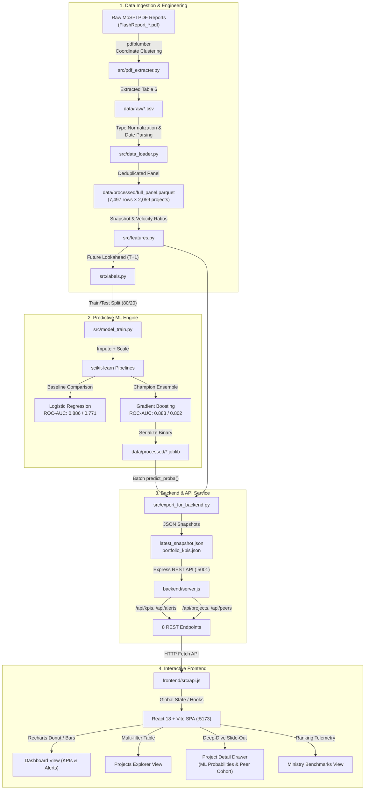
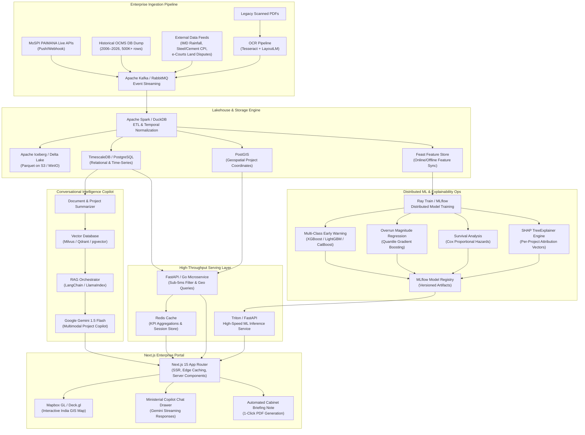

# 01 — System Architecture & Data Flow
### PAIMANA AI: End-to-End Pipeline, Dual-Engine Architecture & Evolution

---

## 1. System Overview & Core Philosophy

### The Non-Technical Intuition (The Hospital Analogy)
Imagine a giant hospital managing **2,000 giant patients** (each project is a ₹1,000+ Crore national infrastructure asset).
1. **Reading Reports**: A digital worker scans the monthly 400-page government health records.
2. **Medical History**: Stacks 4 months of records side-by-side to track patient changes over time.
3. **Checking Vitals (Pure Math)**: Calculates vital signs (spending speed, work velocity, delay months) into an auditable **Health Score (0–100)**.
4. **Predictive AI**: An ensemble model compares the patient's vitals to 7,500 historical cases to forecast: *"There is an 80% chance this patient will need a budget transfusion next month."*
5. **ICU Dashboard**: Ministers view a live control room to catch deteriorating projects before failure.

### The "Dual-Engine" Philosophy
Government bureaucrats and auditors reject black-box AI because they cannot legally justify reprimands on unexplained scores. PAIMANA solves this by decoupling into **two distinct engines**:

```
                       ┌────────────────────────────────────────────────────────┐
                       │                   PAIMANA DUAL ENGINE                  │
                       └───────────────────┬────────────────┬───────────────────┘
                                           │                │
                    ┌──────────────────────▼───────┐ ┌──────▼───────────────────────┐
                    │   ENGINE 1: DESCRIPTIVE      │ │   ENGINE 2: PREDICTIVE       │
                    │   (Current State / Rules)    │ │   (Future Early Warning / ML)│
                    ├──────────────────────────────┤ ├──────────────────────────────┤
                    │ • 100% Deterministic Math    │ │ • Non-linear Machine Learning│
                    │ • "Where is project today?"  │ │ • "What will happen in 30d?" │
                    │ • 0–100 Composite Score      │ │ • Gradient Boosting Trees    │
                    │ • Auditable by CAG / MoSPI   │ │ • Catches hidden stagnation  │
                    │ • Primary Risk Driver        │ │ • Outputs Risk Probability % │
                    └──────────────────────────────┘ └──────────────────────────────┘
```

---

## 2. End-to-End Pipeline (The 6 Execution Stages)

```
[Raw MoSPI PDF]
       │
       ▼ (Stage 1: Coordinate-Based Word Extraction - pdfplumber)
[data/raw/*.csv]
       │
       ▼ (Stage 2: Type Normalization, Date Parsing, Deduplication - pandas)
[data/processed/full_panel.parquet] (7,497 snapshots × 2,059 projects)
       │
       ├──────────────────────────────────────────────┐
       ▼ (Stage 3: Feature Engineering)               ▼ (Stage 4: Label Engineering)
[13 Dynamic Numerical Features]               [Future Shift Labels: T+1]
 - Snapshot Ratios (progress_gap, spend_gap)    - cost_revised_up_label (0/1)
 - Velocity Metrics (progress_velocity)         - schedule_slipped_label (0/1)
 - Agency Baselines (agency_avg_overrun)
       │                                              │
       └──────────────────────┬───────────────────────┘
                              ▼ (Stage 5: Supervised Model Training)
               [scikit-learn Pipelines: Imputer + Scaler]
               - LogisticRegression (Baseline)
               - GradientBoostingClassifier (Production ML)
                              │
                              ▼ (Model Serialization)
               [data/processed/*.joblib Binary Models]
                              │
                              ▼ (Stage 6: Latest Snapshot Inference)
               [latest_snapshot.json] + [portfolio_kpis.json]
                              │
                              ▼ (REST API Service - Node.js/Express :5001)
               [8 API Endpoints: /kpis, /alerts, /projects, /peers, /benchmarks]
                              │
                              ▼ (Frontend UI - React 18 + Vite + Recharts :5173)
               [Interactive Telemetry Dashboard & Deep-Dive Drawer]
```

### Stage Details & Code Symbols:
1. **Extraction** ([`src/pdf_extracter.py`](file:///Users/prem/Documents/Projects/Paimana-analysis/src/pdf_extracter.py)): Uses `pdfplumber` horizontal word-coordinate clustering to reliably extract multi-line wrapped cells from Table 6.
2. **Cleaning** ([`src/data_loader.py`](file:///Users/prem/Documents/Projects/Paimana-analysis/src/data_loader.py)): Strips currency commas, parses MM/YYYY strings into `pd.Timestamp`, deduplicates on `(project_code, report_month_dt)`, outputting `full_panel.parquet`.
3. **Feature Engineering** ([`src/features.py`](file:///Users/prem/Documents/Projects/Paimana-analysis/src/features.py)): Computes 13 snapshot & velocity metrics (e.g., `progress_gap`, `spend_vs_progress_gap`, `progress_velocity`).
4. **Label Creation** ([`src/labels.py`](file:///Users/prem/Documents/Projects/Paimana-analysis/src/labels.py)): Applies `shift(-1)` per project to establish ground truth for the next month ($T+1$).
5. **Model Training** ([`src/model_train.py`](file:///Users/prem/Documents/Projects/Paimana-analysis/src/model_train.py)): Benchmarks `LogisticRegression` against `GradientBoostingClassifier` and dumps trained binaries to `.joblib` files.
6. **Inference & Serving** ([`src/export_for_backend.py`](file:///Users/prem/Documents/Projects/Paimana-analysis/src/export_for_backend.py) & [`backend/server.js`](file:///Users/prem/Documents/Projects/Paimana-analysis/backend/server.js)): Runs `predict_proba()` on the latest snapshot, saving `latest_snapshot.json` served via 8 Express endpoints to the React frontend.

---

## 3. Visual Architecture Diagrams

### Diagram 1: Current Working MVP Flow


---

### Diagram 2: Ideal 20-Year Enterprise Target Architecture
How the system scales to process **20 years of historical OCMS records (500,000+ snapshots)**:



---

## 4. Tech Stack Evolution (MVP vs 20-Year Scaled Production)

| Layer | Current Hackathon MVP | 20-Year Scaled Production | Rationale |
| :--- | :--- | :--- | :--- |
| **Storage** | Parquet (`pyarrow`) | **PostgreSQL + TimescaleDB** | 500K records need ACID transactions, indexes, and fast time-bucket aggregations. |
| **PDF Extraction**| `pdfplumber` (coordinate heuristics) | **LayoutLMv3 + Tesseract OCR** | Parses legacy scanned low-res PDFs (2006–2014 OCMS era) where vector text is absent. |
| **ML Engine** | `GradientBoostingClassifier` | **XGBoost / LightGBM / CatBoost** | Native GPU acceleration, native categorical handling, 10× faster training on 500K rows. |
| **Stats Expansion**| Binary classification | **Quantile Regressor + Cox Survival**| Predicts continuous overrun ₹ Cr and time-to-delay survival probability curves. |
| **Explainability** | Linear weighted decomposition | **SHAP (`TreeExplainer`)** | Mathematical Shapley values with local waterfall contribution plots per project. |
| **Backend API** | Node.js (Express) | **Python FastAPI (Async)** | Loads models in-memory with C-bindings (`onnxruntime`), eliminating JSON export lag. |
| **AI Copilot** | Deterministic string synthesis | **Gemini 1.5 Flash + pgvector (RAG)**| Conversational natural language querying over 20 years of audit records. |
| **GIS Mapping** | State name strings | **PostGIS + Mapbox GL / Deck.gl** | Visualizes projects on a live map of India with interactive risk pins. |

---

## 5. Architectural Analysis: Next.js vs Decoupled React + Separate Backend

### The Trade-off Matrix

| Criterion | Pure Next.js (All-in-One Serverless) | Decoupled: React SPA + Separate Backend (Current) | Decoupled: Next.js + FastAPI Microservice (Roadmap) |
| :--- | :--- | :--- | :--- |
| **Deployment** | ⭐⭐⭐⭐⭐ (Single Vercel click) | ⭐⭐⭐ (Two local processes: frontend & backend) | ⭐⭐⭐ (Vercel for UI, Render/Fly for API) |
| **ML Compatibility** | ❌ **Incompatible**: Serverless runs Node.js. Cannot run `scikit-learn`, `pandas`, or `pdfplumber` natively. | ✅ Python pipelines run cleanly; Node.js serves pre-scored JSON. | ⭐⭐⭐⭐⭐ **The Gold Standard**: Python FastAPI runs ML natively; Next.js renders the UI. |
| **Heavy File Ingestion** | ❌ 50MB payload limits & 10–60s timeouts crash on 400-page MoSPI PDFs. | ✅ Persistent process with access to local filesystem and zero timeouts. | ✅ Asynchronous background worker handles ingestion and retraining. |
| **Demo Stability** | ⚠️ Subject to conference Wi-Fi, Vercel rate-limits, and cold starts. | ✅ **100% Reliable locally**: Runs offline on `localhost:5173` and `:5001`. | ⚠️ Requires reliable cloud hosting. |

### The Winning Interview Pitch:
> *"We evaluated an all-in-one Next.js setup, but deliberately chose a decoupled architecture because of our data science compute requirements. Parsing 400-page government PDFs via coordinate extraction and training 7,500-row tree ensembles requires native Python data science runtimes (`pandas`, `scikit-learn`, `pdfplumber`). Running these inside serverless Node.js functions causes severe memory bottlenecks and timeout crashes. In our enterprise roadmap, we decouple a Next.js 15 UI from an asynchronous Python FastAPI microservice, keeping the ministerial dashboard lightning-fast while heavy data pipelines scale independently."*
